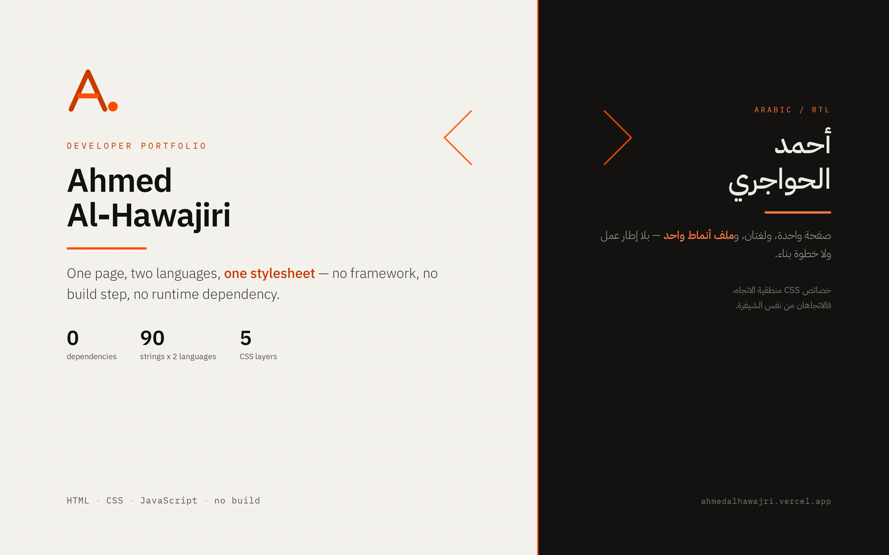

<p align="center">
  
</p>

# Personal Portfolio

[](https://ahmedalhawajri.vercel.app/)

**Live — [ahmedalhawajri.vercel.app](https://ahmedalhawajri.vercel.app/)**

A one-page developer portfolio in Arabic and English, with full RTL/LTR
mirroring and a light and dark theme. Plain HTML, CSS and JavaScript: no
framework, no build step, no runtime dependency.

---

## The idea

The other repositories on this account argue that a system should hold one
source of truth for every fact. This site is that argument applied to itself.

**No colour or size exists outside `tokens.css`.** Every design value starts
there, so changing the identity touches one file rather than forty.

**No sentence is written twice.** Every visible string lives in `i18n.js` under
a key, and the DOM carries only `data-i18n="key"`. Adding a third language
means adding a third object, not copying the page.

**No mirrored stylesheet.** Direction is handled with CSS logical properties —
`inset-inline`, `padding-block`, `margin-inline` — so Arabic and English run
from the same rules. The two deliberate exceptions, the progress bar direction
and the arrows that mean "forward", are documented where they sit.

---

## The part that matters

**It works without JavaScript.** All content ships in the HTML. The scroll
reveal disables itself through `html.no-js`, so if the script fails to load the
page stays readable, navigable and contactable.

**It works from `file://`.** The scripts are classic scripts, not ES modules,
on purpose: browsers block modules under `file://`, which killed every
interaction when the page was opened locally. The cost is two globals on
`window`; the gain is a page that runs wherever it is opened.

**Motion serves meaning and never traps.** One shared `IntersectionObserver`
handles the reveal, and each element unobserves itself once shown.
`prefers-reduced-motion` is honoured completely, not partially.

---

## By the numbers

| | |
|---|---|
| Runtime dependencies | **0** |
| Build step | **none** |
| Translated strings | **90** keys, in two languages |
| CSS layers | 5 files, ~29 KB total |
| Page | one `index.html`, ~30 KB |

---

## Accessibility

- A skip link as the first element on the page
- Correct heading structure: one `h1`, an `h2` per section, an `h3` per item
- Visible `:focus-visible` on every interactive element, touch targets ≥ 48px
- `aria-current` on the active section link, `aria-live` on the copy message
- Contrast measured, not assumed: secondary text 5.9:1 on light and 7.0:1 on
  dark; the orange for small text 4.51:1 and 6.4:1
- No horizontal scroll from 320px to 1440px

---

## Structure

```
personal-portfolio/
├── index.html              one page, semantic structure only, no duplicated copy
├── assets/
│   ├── css/                loaded in exactly this order
│   │   ├── tokens.css      colour, type, spacing, shadow, motion, dark theme
│   │   ├── base.css        reset, typography, accessibility, print
│   │   ├── layout.css      containers, grids, section rhythm, reveal
│   │   ├── components.css  nav, buttons, chips, cards, footer
│   │   └── sections.css    hero, work, process, about, contact
│   ├── js/
│   │   ├── i18n.js         every string in both languages, plus the switcher
│   │   └── main.js         entry point: language, theme, reveal, nav, copy
│   ├── img/                favicon.svg, og.png (1200x630)
│   └── Ahmed-Al-Hawajiri-Full-Stack-Developer.pdf
├── robots.txt
└── sitemap.xml
```

---

## Running it

Double-click `index.html`. It works completely over `file://`, including the
language switch and the dark theme.

For a local server, to test relative paths as they behave in production:

```bash
npx serve .
# or
python3 -m http.server 8000
```

---

## Deploying

A static site with no build step. In Vercel's New Project screen:

| Setting | Value |
|---|---|
| Framework Preset | **Other** |
| Root Directory | `./` |
| Build / Output / Install | *left empty, override off* |

No `vercel.json` is needed — one page, all links internal.

**After deploying,** update the URL in three places in `index.html`
(`link[rel=canonical]`, `og:url`, `og:image`) and in `sitemap.xml`. They
currently point at `https://ahmedalhawajri.vercel.app/`.

---

## Licence

MIT — see [LICENSE](LICENSE).

Built by [Ahmed Al-Hawajiri](https://github.com/ahmedalhawajri89), Gaza.
